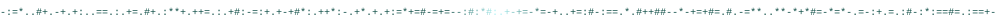

<div align="center">




<p align="center">
<a href="#-about-me"><code>~/about</code></a> &nbsp;
<a href="#-featured-projects"><code>~/projects</code></a> &nbsp;
<a href="#-tech-stack"><code>~/stack</code></a> &nbsp;
<a href="#-github-analytics"><code>~/stats</code></a> &nbsp;
<a href="#-connect-with-me"><code>~/contact</code></a>
</p>

<p align="center">
<a href="https://www.linkedin.com/in/gustavo-mendoza-b15b1a2ab/">

</a>
<a href="mailto:gustavooficial021@gmail.com">

</a>
</p>



</div>

<div align="center">
<a id="-about-me"></a>

</div>

```yaml
Name: Gustavo Mendoza
Role: Full Stack Developer & IT Solutions Engineer
Location: Tegucigalpa, Honduras 🇭🇳

Focus:
  - Networking & Infrastructure
  - Automation
  - Cybersecurity
  - Full Stack Development

Currently Learning:
  - Advanced Networking
  - Cloud Infrastructure
  - DevOps
  - Security Solutions
```

<table align="center">
<tr>
<td align="center" width="25%">

### 💻 Development
<sub><code>./dev</code></sub><br/>
Full Stack Apps<br/>APIs & Automation<br/>Mobile Applications<br/>UI/UX Focused

</td>
<td align="center" width="25%">

### 🌐 Networking
<sub><code>./net</code></sub><br/>
VLANs & Routing<br/>TCP/IP<br/>VPN Solutions<br/>Huawei & Cisco

</td>
<td align="center" width="25%">

### ⚙️ Infrastructure
<sub><code>./infra</code></sub><br/>
Linux Servers<br/>Apache / Nginx<br/>Virtualization<br/>Databases

</td>
<td align="center" width="25%">

### 🛡️ Security
<sub><code>./sec</code></sub><br/>
Firewalls<br/>Secure Access<br/>Cybersecurity<br/>IT Solutions

</td>
</tr>
</table>


<div align="center">
<a id="-featured-projects"></a>

</div>

<table align="center">
<tr>
<td width="50%" valign="top">

**[📚 biblioteca-infinita](https://github.com/tavoMend/biblioteca-infinita)**
<br/><sub><code>~/repos/biblioteca-infinita</code></sub>

Un catálogo de libros que nunca existieron, generado por gramática en el navegador — sin backend, sin IA en producción.


</td>
<td width="50%" valign="top">

**[🖥️ InventarioICN](https://github.com/tavoMend/InventarioICN)**
<br/><sub><code>~/repos/InventarioICN</code></sub>

CRUD de equipos e inmobiliario y gestión de licencias, desarrollado para ICNdigital durante mi práctica profesional.


</td>
</tr>
<tr>
<td width="50%" valign="top">

**[🗃️ SistemaIT](https://github.com/tavoMend/SistemaIT)**
<br/><sub><code>~/repos/SistemaIT</code></sub>

Sistema de control de equipos IT para llevar inventario y seguimiento de activos tecnológicos.


</td>
<td width="50%" valign="top">

**[🔐 Horus](https://github.com/tavoMend/Horus)**
<br/><sub><code>~/repos/Horus</code></sub>

Sistema de inventario simple construido para aprender y aplicar encriptación de bases de datos.


</td>
</tr>
</table>


<div align="center">
<a id="-tech-stack"></a>

</div>

<p align="center"><code>├── languages/</code></p>

<p align="center">

</p>

<p align="center"><code>├── frontend_backend/</code></p>

<p align="center">


</p>

<p align="center"><code>├── databases/</code></p>

<p align="center">


</p>

<p align="center"><code>├── tools_devops/</code></p>

<p align="center">


</p>

<p align="center"><code>├── networking_infrastructure/</code></p>

<p align="center">


</p>

<p align="center"><code>└── hardware_lab/</code></p>

<p align="center">
<a href="https://github.com/tavoMend/ascii-multimeter">

</a>
<br/><sub><code>~/repos/ascii-multimeter</code> · 115 V~ · 60 Hz</sub>
</p>


<div align="center">
<a id="-github-analytics"></a>


<br/><br/>


<br/>


</div>


<div align="center">
<a id="-contribution-snake"></a>


<br/><br/>


</div>


<div align="center">
<a id="-positive-points"></a>

</div>

```diff
+ [OK] Problem Solver            + [OK] Full Stack Development
+ [OK] Fast Learner              + [OK] Networking & Security
+ [OK] Team Collaboration        + [OK] Automation Mindset
+ [OK] Infrastructure Knowledge  + [OK] Continuous Improvement
```


<div align="center">
<a id="-connect-with-me"></a>


<br/><br/>

<a href="mailto:gustavooficial021@gmail.com">

</a>
<a href="https://www.linkedin.com/in/gustavo-mendoza-b15b1a2ab/">

</a>

<br/><br/>


</div>
